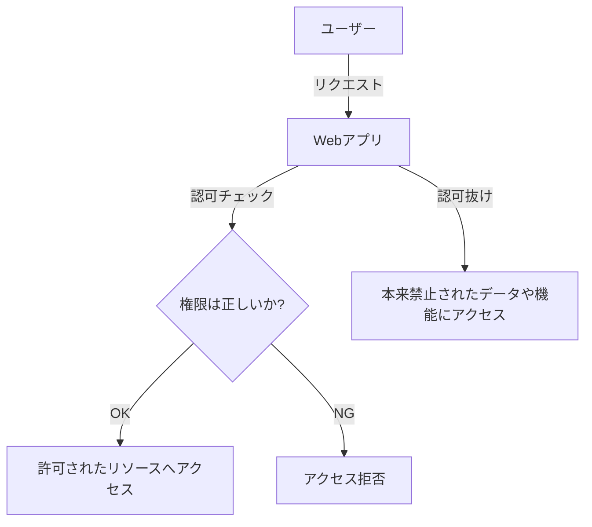

# A01 Broken Access Control（アクセス制御の不備）

OWASP Top 10 で最も深刻とされる脆弱性。  
アクセス制御が壊れていると **本来アクセスできないデータや機能にユーザーが触れてしまう。**

---

## 1. Broken Access Control とは

アクセス制御とは「そのユーザーが *何を* してよいか」を決める仕組み。  
Broken Access Control では、この制御が正しく働かない。

### よくある例

- URL を直接叩くと管理画面に入れてしまう  
- 他人のユーザーIDを指定すると情報が見える（IDOR）  
- クライアント側のボタン非表示だけで制御している

---

## 2. 図解（Mermaid）

---

## 3. よくある脆弱性のパターン

● URL 直打ちで管理画面に入れてしまう

/admin へ直接アクセスすると誰でも入れる。

● IDOR（Insecure Direct Object Reference）

GET /user/1234 → 自分
GET /user/1235 → 他人（本来禁止）

● クライアント側のみで制御

JavaScript でボタン非表示

hidden パラメータで権限判定

→ どちらも容易に改ざんされ、突破される。

---

## 4. 攻撃手法の例

権限昇格（User → Admin）

認可をすり抜けて管理 API を操作

直接 URL からデータを引き抜く

---

## 5. 防止策（実務向け）

サーバー側で必ず認可チェックを行う

ID を推測できない値（UUID など）にする

機能ごとに RBAC / ABAC を設計する

クライアント側のみでの制御は絶対に NG

ログ・アラートで不正アクセスを検知する

---

## 6. 参考資料

OWASP Top 10 (2021)

OWASP Cheat Sheet Series

NIST SP 800-63 / Access Control Guidance

---

## 7. 脆弱なコード例と修正版（Node.js / Express）

❌ 悪い例：ID チェックなし

// ID チェックなし → 他人のデータが取得できてしまう
app.get("/user/:id", (req, res) => {
  const data = db.getUser(req.params.id);
  res.json(data);
});

✔ 良い例：サーバー側で認可チェック

// 修正版：認可チェックをサーバー側で実施
app.get("/user/:id", (req, res) => {
  if (req.user.id !== req.params.id) {
    return res.status(403).send("Forbidden");
  }
  const data = db.getUser(req.user.id);
  res.json(data);
});